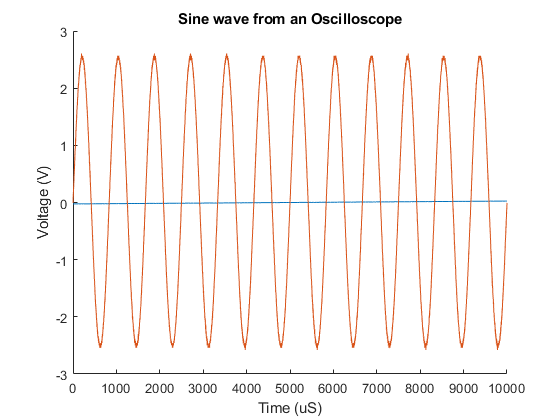

# Keysight EDUX 1000X VISA Data Exporter

## Important

Currently, it is purely configured for the FONTYS keysight scope, due to the hardwired address. This *might* be changed in a future version.

## Prerequisites

Please make sure you have the VISA driver for keysight installed.
You can either use the [dedicated driver link](https://www.keysight.com/us/en/lib/software-detail/computer-software/visa-shared-components-downloads-2504667.html) or the [IO Library Suite](https://www.keysight.com/us/en/lib/software-detail/computer-software/io-libraries-suite-downloads-2175637.html).

## Running

Connect the KEYSIGHT oscilloscope to the PC via a USB-B cable. If you have the **IO Library Suite** installed, you can verify that it is connected correctly, as it shows up in the **IO Library Suite**.

Once connected, run the program. It should state the model number of the scope at the top of the program.
You will be prompted to answer if you want to use the autoscale feature of the scope (or you can use your own settings), as well as which probe channel to use.

Once the data has been transferred, it will be stored in the **data.csv** file. You can use this as you see fit.

## Example

[The Corresponding data file](./example/data.csv)
